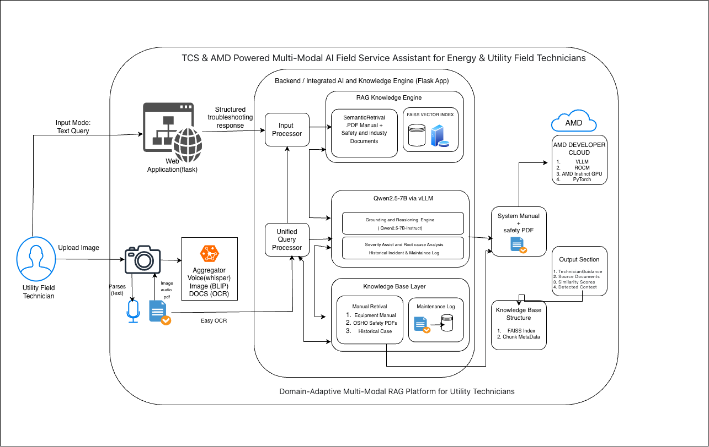
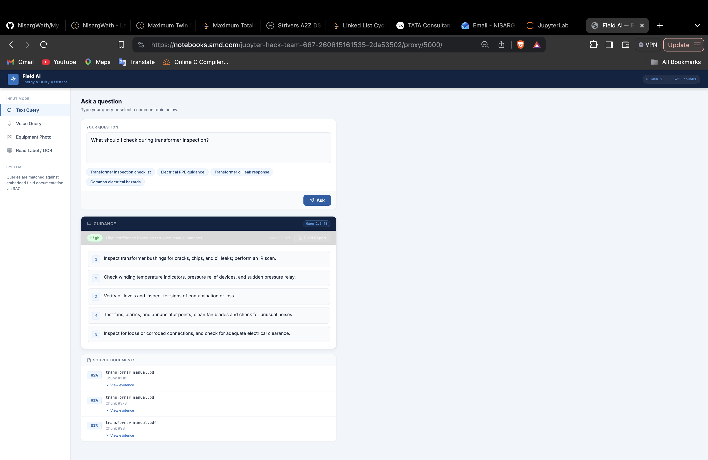
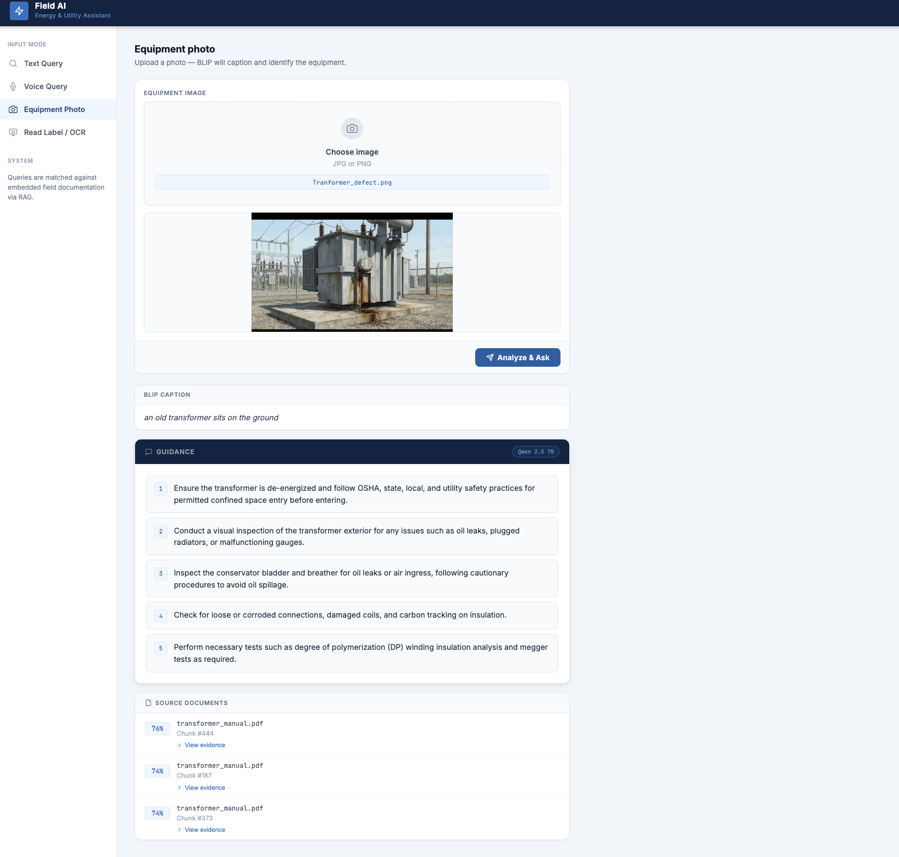
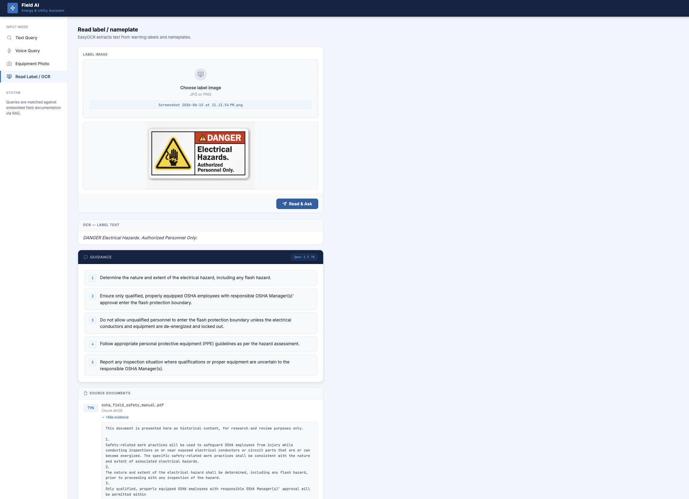
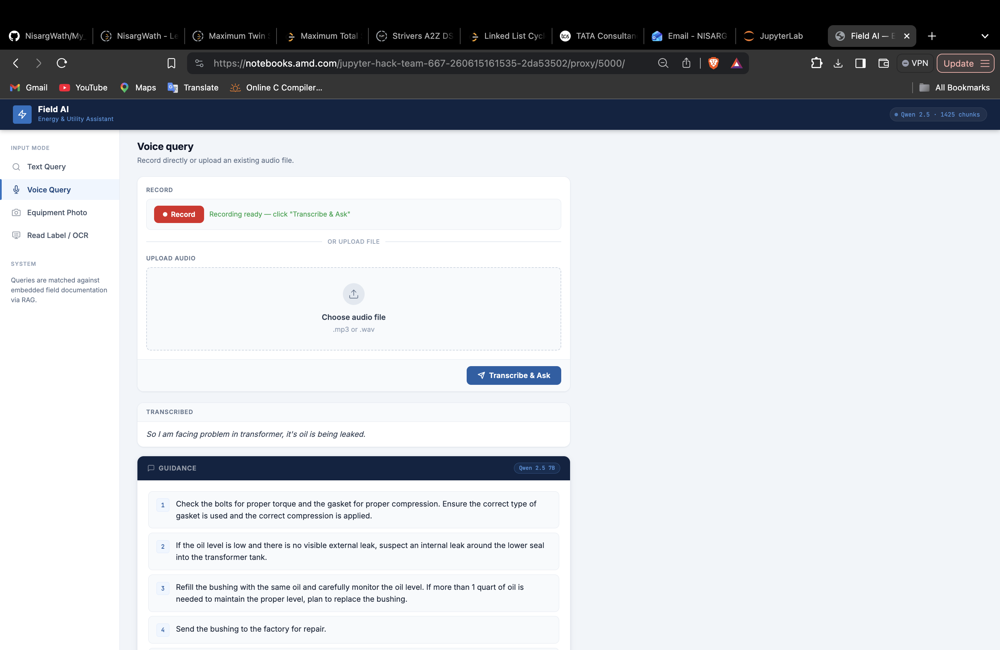

```markdown
# TCS & AMD

# Multi-Modal AI Field Service Assistant

A multi-modal AI assistant for energy and utility field technicians. The system accepts text questions, voice queries, equipment photos, and warning label/nameplate images, then returns grounded maintenance and safety guidance using Retrieval-Augmented Generation over power-grid manuals.

Built for TCS &  AMD Hackathon .

## Overview

Field technicians working on transformers, substations, and electrical systems often need fast, reliable guidance in safety-critical environments. Technical manuals are long, difficult to search on-site, and not always practical during active field work.

This project converts official manuals and safety documents into an AI assistant that can:

- Answer technician questions
- Transcribe spoken field queries
- Interpret equipment images
- Read warning labels and nameplates
- Retrieve relevant manual sections
- Generate source-cited technician guidance

The transformer use case is the first implemented domain slice. The same pipeline can be extended to substations, switchgear, circuit breakers, relays, and other utility assets by adding more manuals.

## Features

- Text query assistant
- Voice query support using Whisper
- Equipment photo analysis using BLIP
- Label/nameplate OCR using EasyOCR
- RAG over PDF manuals
- BGE embeddings with FAISS retrieval
- Qwen2.5-7B via vLLM for grounded answer generation
- Source citations with document name, chunk ID, and similarity score
- Flask API and web UI
- AMD Developer Cloud deployment
```
## Architecture





## Demo Video

[▶️ Watch the Demo Video](https://docs.google.com/videos/d/1yHeZR4F1WSB1vYuQ-CFNe-80JxJS3m8O-2n5OAhw66Y/play)

## Demo Screenshots

### Text Question Interface

Demonstrates the core RAG workflow where technicians ask questions and receive grounded guidance with evidence from manuals.



---

### Equipment Photo Analysis

Shows the multi-modal image understanding pipeline using BLIP to analyze equipment photos and provide maintenance recommendations.



---

### OCR-Based Label Reading

Demonstrates extraction of text from warning labels and nameplates using EasyOCR, followed by retrieval of relevant safety procedures.



---

### Voice Query Assistant

Illustrates speech-based interaction where Whisper transcribes technician queries and the RAG system generates evidence-backed guidance.



## Tech Stack

- Python 3.12
- Flask
- PyMuPDF
- SentenceTransformers
- BAAI/bge-small-en-v1.5
- FAISS
- Whisper
- BLIP
- EasyOCR
- Qwen2.5-7B-Instruct
- vLLM
- AMD Developer Cloud

## Project Structure

```text
field-service-rag-main_TCS-AMD/
├── app.py
├── demo.py
├── requirements.txt
├── static/
│   └── index.html
├── rag/
│   ├── build_index.py
│   ├── document_loader.py
│   ├── chunker.py
│   ├── embedder.py
│   ├── retriever.py
│   ├── answer_generator.py
│   ├── llm_generator.py
│   ├── query_rag.py
│   ├── query_image.py
│   ├── voice_input.py
│   ├── ocr_reader.py
│   └── image_analyzer.py
└── data/
    ├── manuals/
    ├── index/
    └── uploads/
```

## Setup

Clone the repository:

```bash
cd /workspace
git clone https://github.com/NisargTCS/field-service-rag-main_TCS-AMD.git
cd field-service-rag-main_TCS-AMD
```

Install dependencies:

```bash
python3 -m pip install -r requirements.txt
```

If needed, install additional packages:

```bash
python3 -m pip install pymupdf sentence-transformers faiss-cpu numpy transformers accelerate flask easyocr openai-whisper gTTS pydub Pillow vllm
```

Install ffmpeg:

```bash
wget -O /tmp/ffmpeg.tar.xz https://johnvansickle.com/ffmpeg/releases/ffmpeg-release-amd64-static.tar.xz
tar -xf /tmp/ffmpeg.tar.xz -C /tmp/
cp /tmp/ffmpeg-*-amd64-static/ffmpeg /usr/local/bin/ffmpeg
chmod +x /usr/local/bin/ffmpeg
```

Verify:

```bash
ffmpeg -version
```

## Download Manuals

```bash
mkdir -p data/manuals
cd data/manuals

wget -O transformer_manual.pdf "https://usbr.gov/tsc/techreferences/mands/mands-pdfs/Trnsfrmr.pdf"

wget -O osha_electrical_safety.pdf "https://www.osha.gov/sites/default/files/publications/OSHA3075.pdf"

wget -O osha_field_safety_manual.pdf "https://www.osha.gov/sites/default/files/enforcement/directives/ADM_04-00-001.pdf"

wget -O substation_design_guide.pdf "https://www.rd.usda.gov/sites/default/files/UEP_Bulletin_1724E-300.pdf"

wget -O osha_lockout_tagout.pdf "https://www.osha.gov/Publications/osha3120.pdf"

wget -O niosh_electrical_safety.pdf "https://www.cdc.gov/niosh/docs/2009-113/pdfs/2009-113.pdf"

cd ../..
```

## Build the RAG Index

```bash
pip install sentence_transformers
python3 rag/build_index.py
```

This creates:

```text
data/index/manuals.faiss
data/index/chunks.json
```

## Run the System

The system uses two servers.

### Terminal 1: Start vLLM

```bash

cd /workspace/field-service-rag-main_TCS-AMD

python3 -m vllm.entrypoints.openai.api_server \
  --model Qwen/Qwen2.5-7B-Instruct \
  --host 0.0.0.0 \
  --port 8000
```

Check vLLM:

```bash
curl http://127.0.0.1:8000/v1/models
```

### Terminal 2: Start Flask
```bash
python3 -m pip install flask --ignore-installed blinker
```
Then test:
```bash 
python3 -c "import flask; print('flask ok')"
Then run:
```

```bash


cd /workspace/field-service-rag-main_TCS-AMD-main_TCS-AMD
python3 -m pip install easyocr
python3 -c "import easyocr"
python3 -m pip install -U openai-whisper
python3 -c "import whisper; print('Whisper OK')"

python3 app.py
```

Check Flask:

```bash
curl http://127.0.0.1:5000/health
```

Expected response:

```json
{
  "status": "ok",
  "vectors": 1160,
  "chunks": 1160,
  "llm": "Qwen2.5-7B via vLLM"
}
```

## Open the Web UI on AMD Developer Cloud

Do not use laptop `localhost`.

Use the AMD Jupyter proxy URL:

```text
https://notebooks.amd.com/<your-instance-id>/proxy/5000/
```

Example:

```text
https://notebooks.amd.com/jupyter-hack-team-667-260610160512-aa12fa09/proxy/5000/
```

## API Endpoints

| Method | Endpoint | Description |
|---|---|---|
| GET | `/health` | Health check and vector count |
| POST | `/query` | Text query |
| POST | `/query/voice` | Audio file query |
| POST | `/query/image` | Equipment image query |
| POST | `/query/ocr` | Label/nameplate OCR query |

## API Tests

Text query:

```bash
curl -X POST http://127.0.0.1:5000/query \
  -H "Content-Type: application/json" \
  -d '{"query":"What should I check during transformer inspection?"}'
```

Voice query:

```bash
curl -X POST http://127.0.0.1:5000/query/voice \
  -F "file=@data/test_query.mp3"
```

OCR query:

```bash
curl -X POST http://127.0.0.1:5000/query/ocr \
  -F "file=@data/test_label.jpg"
```

Image query:

```bash
curl -X POST http://127.0.0.1:5000/query/image \
  -F "file=@data/test_equipment.jpg"
```

## CLI Usage

```bash
python3 rag/query_rag.py "What should I check during transformer inspection?"
```

```bash
python3 rag/query_rag.py "What PPE should a technician use around electrical equipment?"
```

```bash
python3 rag/voice_input.py data/test_query.mp3
```

```bash
python3 rag/ocr_reader.py data/test_label.jpg
```

```bash
python3 rag/query_image.py data/test_equipment.jpg
```

## Demo Questions

```text
What should I check during transformer inspection?
```

```text
What should I do if I find oil leaks on a transformer?
```

```text
What PPE should a technician use around electrical equipment?
```

```text
What are common electrical hazards for field technicians?
```

```text
What lockout tagout steps are required before electrical maintenance?
```

```text
What safety precautions should be followed around high voltage equipment?
```


## Author & Team

Built by **Nisarg Wath**  
Team: **team-667**
ID: **3271786"

